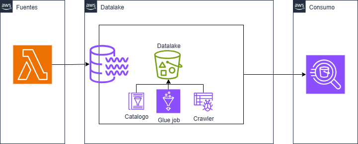
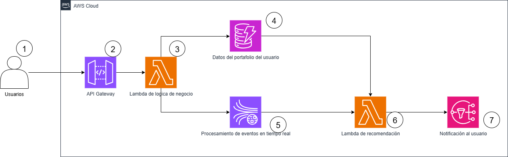

# Prueba_DataEngAWS

## Ejercicio 1
Una compañía comercializadora de energía compra la electricidad a los generadores en el mercado
mayoritario, donde después de una serie de contratos y control riesgos de precios esta se vende a los
usuarios finales que pueden ser clientes residenciales, comerciales o industriales.
El sistema de la compañía que administra este producto tiene la capacidad de exportar la información
de proveedores, clientes y transacciones en archivos CSV.

Requisitos técnicos:
1. Crear una estrategia de datalake en s3 con las capas que usted considere necesario tener y cargue esta
información de manera automática y periódica. Los archivos deben particionarse por fecha de carga.
2. Realice 3 transformaciones básicas de datos utilizando AWS Glue y transforme la información para que
esta sea almacenada en formato parquet en una zona procesada.
3. Utilizando AWS Glue, crea un proceso que detecte y catalogue automáticamente los esquemas de los
datos almacenados en el datalake.
4. Utilizando Amazon Athena desde Python, realiza consultas SQL básicas sobre los datos que han sido
transformados.

Documentación:
1. Realiza una descripción detallada del pipeline de datos construido.
2. Indica que proceso es necesario seguir para configurar permisos y políticas para los diferentes servicios
de AWS utilizados.

El pipeline de datos construido se da en tres etapas:
1. Ingesta de información (simulada usando una función lambda), escribiendo a la capa bronze del datalake.
2. Catalogado de la información mediante el uso de crawlers en Glue.
3. Procesamiento (transformación y agregación) de información, mediante un job en Glue, y escritura a la capa silver.
4. Consumo de los resultados en silver mediante Athena.

Para configurar permisos y políticas hay que considerar:
- S3: Establecer una politica para el bucket.
- Glue: Establecer los permisos que tienen las cargas de trabajo a ejecutarse mediante un rol con los privilegios necesarios. 
- Lambda: Establecer los permisos requeridos mediante el uso del rol que la función asume al ejecutarse.
- Athena: Otorgarle los permisos necesarios a la identidad que va a usar el servicio.

Notas:
- Se registra en la carpeta 'terraform' el código de IaC para:
    - Crear el datalake (bucket de S3) y simular las capas bronze, silver y gold.
    - Crear una lambda para simular los conjuntos de datos a recibir (incluye una layer personalizada para la libreria faker) y guardarlos en la capa bronze del datalake.
    - Crear una base de datos y los crawlers respectivos para Glue.
- Se registra en la carpeta 'scripts':
    - Código del job a crear en Glue. Este código se usa para realizar la transformación implementada.
    - Código de la consulta de Athena usando el SDK de Python.

## Ejercicio 2
Un startup ofrece a sus clientes una plataforma en la cual pueden comprar y vender dólares en tiempo
real. Con el fin de ofrecer una experiencia más personalizada, se quiere crear un modelo que, de
acuerdo con los patrones transaccionales históricos del usuario, pueda enviarles una notificación
sugiriendo realizar una transacción según el precio del mercado y su portafolio (comprar o vender
dólares).
Según esto, dibuja con el mayor detalle posible una arquitectura de datos que permita gestionar de
forma eficiente este requerimiento teniendo en cuenta los diferentes servicios que ofrece AWS. Si se
requieren supuestos, expréselos junto con el diagrama creado.

La arquitectura propuesta considera:
1. Usuarios interactuan con la plataforma.
2. La API Gateway se utiliza para autenticación y manejo de las peticiones hechas por el usuario.
3. La función lambda se encarga aplicar la logica de negocio necesaria.
4. La DynamoDB almacena los datos del usuario y de su portafolio, así como un resumen de su transaccionalidad.
5. Al haber un cambio en el precio del dolar, la API externa genera un evento y lo envia a la plataforma.
6. El evento es recibido por un stream de Kinesis.
7. El evento es procesado, junto con la información de los portafolios de los usuarios, para establecer si se debe recomendar o no.
8. En caso afirmativo, se le notifica al usuario por SMS o correo, o similar.

## Ejercicio 3
Preguntas generales:
1. ¿Qué experiencias has tenido como ingeniero de datos en AWS? ¿Cuál ha sido el proyecto más retador
y por qué?

He trabajado principamente en proyectos de Databricks en AWS, donde hacia parte del equipo de analítica, orientado a procesar grandes volumenes de información para responder preguntas de negocio y automatizar la generación de dashboards. Los retos más relevantes en ese aspecto han tenido que ver con el entendimiento del negocio, y la optimización y automatización del procesamiento.

2. ¿Que estrategias has aplicado para crear los recursos necesarios en AWS para mantener una
arquitectura y pipelines de datos?

Infraestructura, creada con IaC como Terraform o Cloud Formation, para el esqueleto de la plataforma.

3. ¿Qué consideraciones tomarías al decidir entre almacenar datos en Amazon S3, RDS o Redshift?

- Caso de uso: Almacenamiento? Base de datos transaccional? Sistema analitico optimizado para procesamiento de big data?
- Escalabiliad requerida.
- Costo.
- Latencia.

4. ¿Qué beneficios y desventajas ves al utilizar AWS Glue en comparación con Lambda o Step Functions
para orquestación ETL?

Beneficios: Glue es un servicio que está diseñado para trabajar procesamiento de grandes volumenes de información mientras que Lambda por ejemplo tiene limites de memoria / tiempo que la hacen ideal para cargas de trabajo más ligeras.
Desventajas: Costo. Glue es significativamente más costoso que sus pares.

5. ¿Cómo garantizarías la integridad y seguridad de los datos de un datalake construido en Amazon S3?
Para ello se debe cifrar los datos tanto en reposo como en transito, establecer politicas de minimo privilegio y gobernar el acceso mediante el uso de servicios como LakeFormation, así como realizar la auditoria sobre dicho acceso. 

